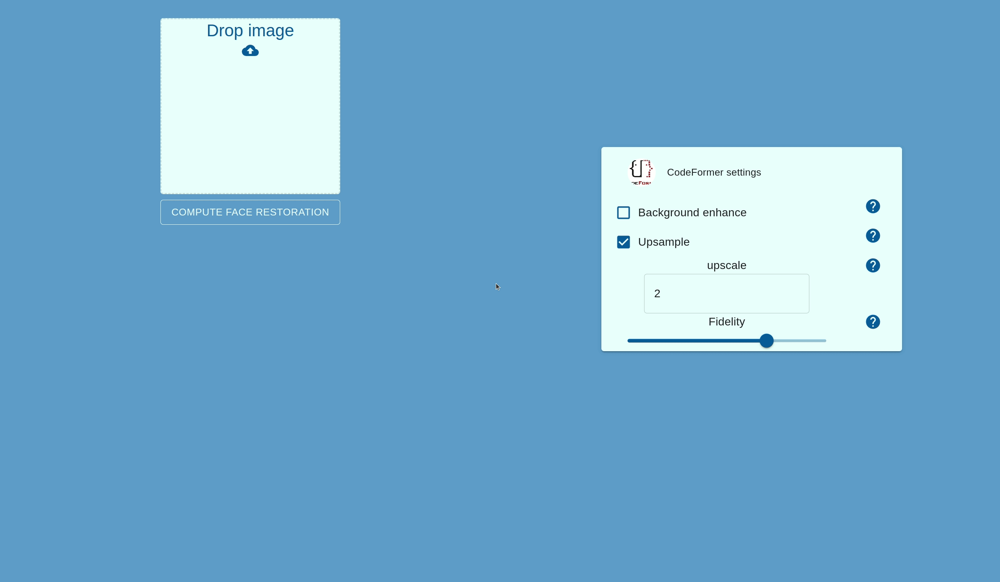

# Face Restoration

A web app for face restoration.
Built with **docker, docker-compose, fastapi, gRPC, react-typescript and nginx**.



## Run the project

:warning: To build the image, you must have an internet access in order to download the models

```bash
git clone git@github.com:rm-rfred/face-restoration.git

cd face-restoration

# Copy and fill the env file
cp .env.example .env

docker-compose build
docker-compose up -d
```

The app should be available on your [browser](http://172.17.0.1:10134)

## Inference on GPU

In order to run inference on your GPU, you **must** have :

- NVIDIA driver installed
- NVIDIA container toolkit installed

Check out [here](https://github.com/NVIDIA/nvidia-container-toolkit) how to install it on your local device

Then, set DEVICE=cuda:0 on your .env file

## gRPC face restoration worker

Check out the face restoration gRPC worker serving codeformer model [here](https://github.com/rm-rfred/face-restoration-worker)

## Dependencies

- Docker version **24.0.6**, build ed223bc
- Docker Compose version **v2.23.0**
- [NVIDIA container toolkit](https://github.com/NVIDIA/nvidia-container-toolkit)

### Shutdown the app

```bash
docker-compose down
```
